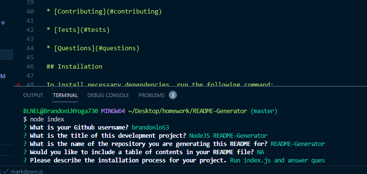
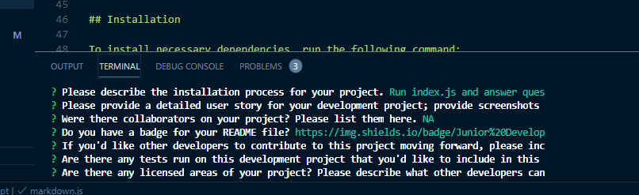

# NodeJS README Generator

   
## GitHub Repository: https://github.com/brandonln53/README-Generator

## In terminal, make certain node is installed. Install the inquirer and path packages (npm i inquirer, then the same command with path); then run node index.js and answer the questions.
## Upon completion of the questions, a markdown README file will be generated populated with the information from the answers.
## This README generator is designed for any developer who wants an efficient means of generating a file that conforms to the [Good README Guide](https://du.bootcampcontent.com/denver-coding-bootcamp/du-den-fsf-ft-03-2020-u-c/blob/master/Class-Content/01-HTML-Git-CSS/04-Supplemental/Good-README-Guide/README.md).

* There were no collaborators in this project.
* There are no associated licenses that would apply to this project.
* You may be able to run npm test on this project. As of 4/16/2020, there is an issue with function generateMarkdown not being defined.

